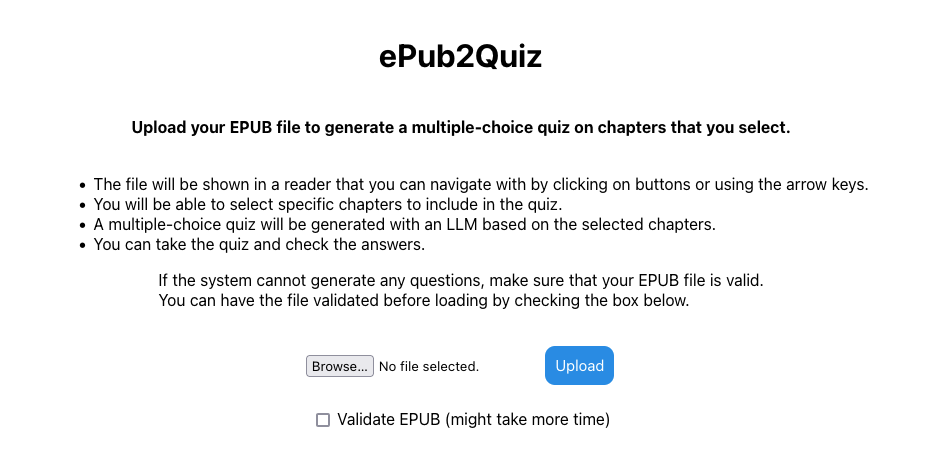
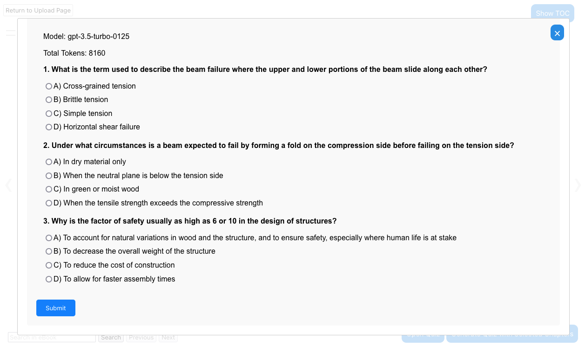
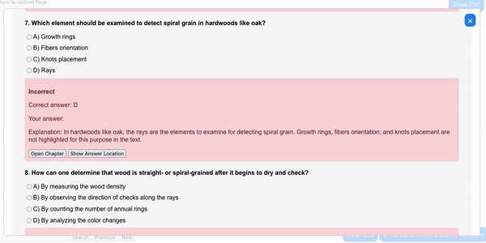
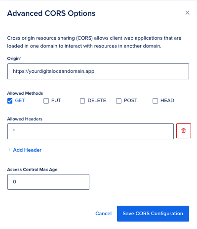

# ePub2Quiz  ✨📖❔✨

The ePub2Quiz web app generates interactive multiple-choice quizzes with text content from EPUB files and is optimized for non-fiction books. The user can upload an EPUB file, display and navigate the file in a reader, and generate quizzes from the content. The quizzes are generated with LLMs by OpenAI and Google. The app is built with React and Flask, deployed on Digital Ocean's App Platform and uses Digital Ocean Spaces for file storage and Redis for caching. For instructions on how to deploy your own ePub2Quiz web app, see below.

**Disclaimer:** This web app is intended for personal use and educational purposes. The models used for quiz generation come with their own cost of use and terms of service, so make sure to check them before using the app yourself.

# Screenshots 








# How to deploy your own ePub2Quiz web app
## Initial setup
<ol>
  <li>Fork this repository to your own GitHub account</li>
  <li>Create a text file or `.env` file locally to store the environment variables below. The following steps will guide you through the process of obtaining them. Do not upload this file to GitHub!</li>
</ol>


```
BUCKET_NAME=[name of the spaces bucket you created]
SPACES_KEY=[spaces key]
SPACES_SECRET=[spaces secret]
OPENAI_ORG=[openai organization id]
OPENAI_API_KEY=[openai api key]
REDIS_PW=[your redis password]
REDIS_HOST=[your redis host address]
WEB_PASS=[password you want to use for the web app]
GAPI=[google api key]
```

## Set up Digital Ocean App Platform
<ol>
    <li>Sign in with your GitHub account on <a href="https://www.digitalocean.com/">https://www.digitalocean.com/</a></li>
    <li>Create a project on Digital Ocean</li>
    <li>On the top right corner, click on "Create" and then on "App Platform"</li>
    <li>Choose the GitHub repository you just cloned</li>
    <li>Edit the resource size to a $5/month plan (sufficient for this project, you might be able to get free credits with a trial or student account)</li>
    <li>Press next until you can click "Create Resources"</li>
    <li>Wait until the app is deployed, then click on "Live App" to open the app and copy the URL</li>
</ol>

## Configure Spaces
<ol>
    <li>In the Digital Ocean project dashboard, click on "Spaces" and create a new Space with a unique name</li>
    <li>If you chose any other location than Frankfurt, change the `endpoint_url` in `api/app.py`</li>
    <li>Insert your unique name into the `BUCKET_NAME` variable in the `.env` file</li>
    <li>On the Spaces page, click on "Settings" and then on "CORS Configurations" with the settings below (replace Origin with your URL you copied earlier):</li>
    <li>On the sidebar, click on "API" and then on "Spaces Keys" and create a new access key. Copy the key and secret key and insert them into the `.env` file as `SPACES_KEY` and `SPACES_SECRET`</li>
</ol>
    


## Set up OpenAI API
<ol>
    <li>Create an api key on <a href="https://platform.openai.com/">https://platform.openai.com/</a> by navigating to the "API Keys" tab and clicking on "Create API Key". Copy the key and insert it into the `.env` file as `OPENAI_API_KEY`</li>
    <li>On the sidebar, click on "Settings", then on "Personal/General" and copy the "Organization ID" and insert it into the `.env` file as `OPENAI_ORG`</li>
    <li>Make sure you have enough money on your OpenAI account to use the API</li>
</ol>

## Set up Redis


<ol>
    <li>Go to <a href="https://redis.io/try-free/">https://redis.io/try-free/</a> and create a free database (e.g. Google Cloud as vendor and Frankfurt as region). Once you have created the database, press "Connect" and open the instructions "Redis Client" for Python. Copy the host and insert it into the `.env` file as `REDIS_HOST`.</li>
    <li>To copy the password, click on your newly created database in the list, and scroll until you find "Default User Password" and copy it. Insert it into the `.env` file as `REDIS_PW`</li>
</ol>

## Set up Web App Password
<ol>
    <li>Insert a password of your choice into the `.env` file as `WEB_PASS`</li>
</ol>

## Set up Google API Key
<ol>
    <li>Go to <a href="https://aistudio.google.com/">https://aistudio.google.com/</a> and sign in </li>
    <li>Click on "Get API key", create an API key in a new project. Copy and insert it into the `.env` file as `GAPI`. For production use, make sure to check the terms of service.</li>

Note: Depending on your location, there might be no free tier available. If you do not want to use it, you can change the value of the `approach` variable in `api/app.py` from `gemini` to `split_parts` or `random_chapters` to control the behaviour when there are too many tokens for GPT-3.5 to handle.
</ol>

## Add Environment Variables to Digital Ocean
<ol>
    <li>Go to your Web App project dashboard and click on "Settings" and scroll down to "App-Level Environment Variables""</li>
    <li>Click on "Bulk Editor" and paste the content of the `.env` file into the editor</li>
</ol>

## Enjoy your ePub2Quiz Web App 
<ol>
    <li>Open the URL of your app and enter the password you chose earlier</li>
    <li>Upload an EPUB file and enjoy your quizzes! </li>
</ol>

# Overview of important files in this repository
`api/` contains the Flask backend

`api/app.py` entry point for the Flask backend: handles the file upload, authentication and quiz generation logic by using the other files in the api folder

`api/lm_quiz_generation.py` generates quizzes using LLMs: includes the prompts and model names

`api/parse_hrefs.py` parses the selected chapters from the EPUB file and handles the caching

`ebook2quiz/` contains React frontend

`ebook2quiz/src/App.js`: manages routing and includes password protection

`ebook2quiz/src/FileUpload.js`: manages upload interface and sends the file to the backend

`ebook2quiz/src/Quiz.js`: displays the multiple-choice quiz generated by the backend: manages user responses and feedback 

`ebook2quiz/src/Reader.js`: displays the EPUB file and allows the user to select chapters for the quiz (includes most components of the interface)

`Dockerfile`: instructions for building the Docker image; if you change the app structure, you need to adjust the Dockerfile accordingly

